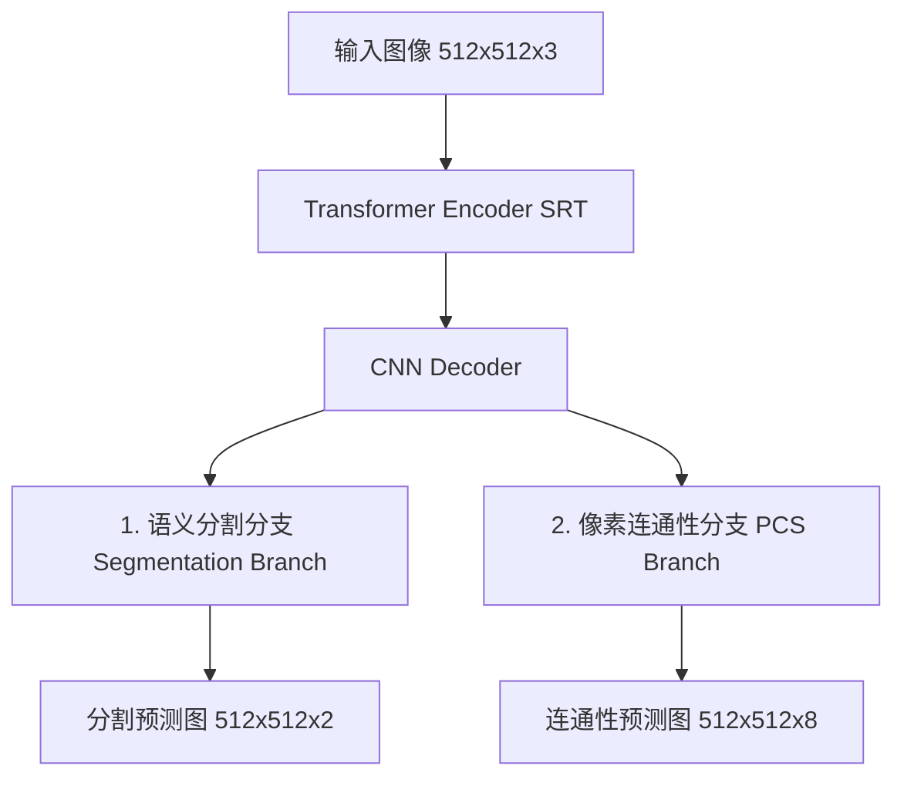

# Seg-Road 论文基础知识框架与知识点整理

本设计文档旨在梳理论文《Seg-Road: A Segmentation Network for Road Extraction Based on Transformer and CNN with Connectivity Structures》的核心技术框架、基础知识点以及关键公式，为后续代码复现提供理论指导。

---

## 1. 论文元信息 (Metadata)

*   **标题**: Seg-Road: A Segmentation Network for Road Extraction Based on Transformer and CNN with Connectivity Structures
*   **作者**: Jingjing Tao, Zhe Chen, Zhongchang Sun 等
*   **发表期刊**: *Remote Sensing*, 2023, 15, 1602
*   **核心解决问题**: 遥感图像道路提取中的**道路断裂与碎片化 (Fragmentation)** 现象。

---

## 2. 研究背景与核心痛点

1.  **遥感道路提取的难点**:
    *   道路在遥感影像中占比小、长宽比极大（狭窄细长）、跨度广。
    *   容易受到建筑物阴影、树木遮挡以及地表灰度变化不均的影响。
2.  **传统深度学习分割的问题**:
    *   传统的语义分割模型（如 U-Net, DeepLab）主要采用**像素级损失函数**（如 Binary Cross-Entropy, BCE）。
    *   BCE 独立计算每个像素的分类误差，**无法约束道路的全局拓扑结构和连通性 (Connectivity)**，导致预测出的道路网充满碎点和断裂。

---

## 3. Seg-Road 核心网络架构

Seg-Road 采用 **Encoder-Decoder (编码器-解码器)** 架构，引入了多任务学习分支。其整体结构包含三个核心部分：



### 3.1 编码器 (Encoder): Spatial Reduction Transformer (SRT)
*   **作用**: 提取全局上下文信息和长距离依赖关系。道路具有强连通性，只有全局视野才能在遮挡处推断出道路的走向。
*   **改进**: 传统的 Transformer 自注意力机制复杂度为 `O(N^2)`。论文引入了 **SRT (空间自适应缩减 Transformer)**，通过空间缩减算子减小 Key (`K`) 和 Value (`V`) 的空间尺寸，将自注意力计算复杂度降低。

### 3.2 解码器 (Decoder): CNN-based Feature Fusion
*   **作用**: CNN 具有极强的局部细节提取能力，用于补充和恢复道路的边缘和纹理细节。
*   **设计**: 融合编码器中不同 Stage（共 4 个 Block）的特征，通过上采样拼接，最后用卷基层融合输出。

### 3.3 创新分支: 像素连接结构 (Pixel Connectivity Structure, PCS)
*   **作用**: 预测道路像素之间的拓扑连通关系，辅助减少断裂。
*   **机制**: 
    *   预测每个像素在 **8 个邻域方向**（左上、上、右上、左、右、左下、下、右下）上、距离为 `r` 的像素是否也是道路。
    *   PCS 的输出通道数为 8。

---

## 4. 关键数学公式

### 4.1 空间缩减自注意力 (Spatial Reduction Attention)
空间缩减操作记为 `SR(x)`，将特征图 `x` 的空间维度减小 `r^2` 倍。

```text
x shape: HW x C
SR(x) = Norm(Reshape(x, r) * W)
```

其中 `W` 为线性投影矩阵，`Norm` 为 LayerNorm。
缩减后的自注意力机制计算如下：

```text
Attention(Q, K, V) = Softmax((Q * SR(K)^T) / sqrt(d_k)) * SR(V)
```

### 4.2 像素连通性标签生成 (PCS Label Generation)
对于 Ground Truth 道路掩膜 `Y`，PCS 标签 `Target_con` 的第 `d` 个方向、坐标 `(y, x)` 处的计算为：

```text
Y shape: H x W
Target_con shape: 8 x H x W
Target_con[d, y, x] = Y[y, x] AND Y[y + dy_d, x + dx_d]
```

其中 `(dy_d, dx_d)` 是第 `d` 个方向上跨度为 `r` 的偏移量。只有当前像素和目标像素**同为道路 (1)** 时，连通性标签才为 1，否则为 0。

### 4.3 联合损失函数 (Joint Loss)
网络采用端到端多任务训练，总损失函数为：

```text
Loss = L_seg + alpha * L_con
```

*   `L_seg`: 分割分支的常规二分类交叉熵损失 (BCE Loss)。
*   `L_con`: PCS 分支的 8 通道 BCE 损失。
*   `alpha`: 连通性损失权重，论文实验中设为 **0.2**，以确保分割主任务占据主导地位。

---

## 5. 实验设置与指标对比

### 5.1 数据集
1.  **DeepGlobe**: 分辨率 0.5m，单张大小 `1024 x 1024`，训练时裁剪为 `512 x 512`。
2.  **Massachusetts**: 航空影像，分辨率 1m，大小 `1500 x 1500`，按步长 512 裁剪为 `512 x 512`。

### 5.2 核心指标（DeepGlobe 数据集对比）

| 模型 | IoU_road (%) | MIoU (%) | F1 (%) | Precision (%) | Recall (%) | FPS |
| :--- | :---: | :---: | :---: | :---: | :---: | :---: |
| D-LinkNet | 57.62 | 63.00 | 77.11 | 76.69 | 77.53 | 96 |
| CoANet | 59.11 | 69.42 | 81.22 | 78.96 | 83.61 | 61 |
| **Seg-Road-s** | 61.14 | 78.49 | 87.67 | 86.45 | 88.93 | **109** |
| **Seg-Road-m** | 64.31 | 80.64 | 89.41 | 86.56 | 92.45 | 81 |
| **Seg-Road-l** | **67.20** | **82.06** | **91.43** | **90.05** | **92.85** | 42 |

---

## 6. 代码复现路线图 (Roadmap)

在 `code/` 文件夹中，我们将按照以下阶段实现复现：

*   [ ] **Stage 1**: 实现数据预处理与 PCS 标签生成脚本。
*   [ ] **Stage 2**: 构建基于 SRT 的 Transformer 编码器模块。
*   [ ] **Stage 3**: 搭建 CNN 解码器与双分支输出网络架构。
*   [ ] **Stage 4**: 编写训练与联合损失计算代码。
*   [ ] **Stage 5**: 实现推理逆映射与融合后处理模块。

---

## 7. 论文原文精读：摘要与引言

### 7.1 论文真正要解决的问题

论文首先强调道路提取的应用价值：道路信息与城市建设、公共交通、无人驾驶和 GIS 都有关。遥感图像数量巨大，完全依靠人工提取道路既耗时，也难以扩展。

道路提取的困难主要来自：

```text
道路形状复杂
道路狭窄
道路跨度很大
树木、建筑和阴影会遮挡道路
道路亮度和颜色可能发生变化
```

这些因素会导致预测结果出现：

```text
道路断裂
道路碎片化
局部误检和漏检
```

### 7.2 传统方法和普通分割方法的不足

论文回顾的传统方法大致分为两类：

```text
基于专家知识、几何形状和道路骨架的方法
基于目标检测、图分割或 SVM 的方法
```

前者依赖规则和人工设计，计算复杂，自动化能力有限；后者容易受到阴影、灰度变化、道路尺度差异和复杂形状影响。

深度学习虽然提高了自动化程度，但论文指出普通像素级损失仍有一个问题：

```text
BCE 逐像素判断对错，却不直接约束道路拓扑结构
```

因此，即使单个像素的分类结果看起来不错，道路整体仍可能断开。

### 7.3 论文的三条主要贡献

论文原文在引言末尾概括了三点贡献：

1.  提出 Seg-Road，在 DeepGlobe 数据集上达到 `67.20%` 的 IoU，在 Massachusetts 数据集上达到 `68.38%` 的 IoU。
2.  将 Transformer 和 CNN 结合起来：Transformer 提取全局信息，CNN 提取局部信息。
3.  提出 PCS，用于改善遥感道路分割中的碎片化，并分析当前模型的不足和未来方向。

### 7.4 论文逻辑链

读到这里，可以把论文的逻辑压缩成：

```text
道路很长且容易断裂
-> 单纯 CNN 的全局感受能力不足
-> 单纯像素损失不关心拓扑连通
-> Transformer 补充长距离依赖
-> CNN 补充局部细节
-> PCS 显式监督道路连接关系
-> 共同改善道路分割结果
```

### 7.5 摘要中的实验结论

论文使用两个数据集验证模型：

```text
DeepGlobe
Massachusetts
```

摘要报告的主要结果为：

```text
DeepGlobe:
IoU 67.20%
MIoU 82.06%
F1 91.43%
Precision 90.05%
Recall 92.85%

Massachusetts:
IoU 68.38%
MIoU 83.89%
F1 90.01%
Precision 87.34%
Recall 92.86%
```

这些数字是论文报告的实验结果，不等于当前项目已经复现出的结果。当前项目只完成了模型模块原型和基础自测，还没有正式训练和评估。
